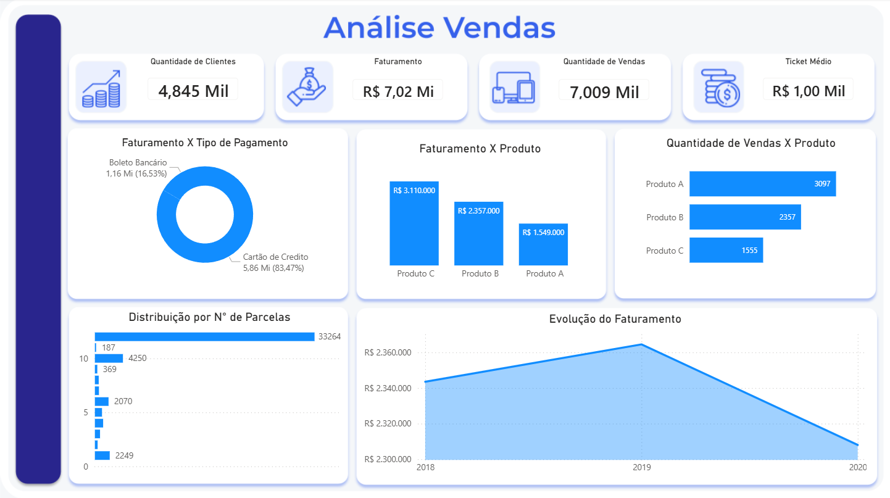

# Dashboard de Análise de Vendas

## Sobre o Projeto

Este projeto foi desenvolvido utilizando Power BI com o objetivo de analisar o desempenho de vendas, identificar padrões de consumo e fornecer indicadores para apoio à tomada de decisões.

O dashboard permite acompanhar métricas de faturamento, quantidade de vendas, ticket médio, formas de pagamento, parcelamento e desempenho dos produtos.

## Objetivos

* Monitorar o faturamento total.
* Avaliar o volume de vendas realizadas.
* Identificar os produtos com melhor desempenho.
* Analisar os métodos de pagamento utilizados pelos clientes.
* Acompanhar a evolução do faturamento ao longo do tempo.
* Explorar informações geográficas dos clientes através dos dados de localização.

## Tecnologias Utilizadas

* Power BI
* Power Query
* DAX
* XML
* Modelagem de Dados
* ETL (Extração, Transformação e Carga)

## Estrutura dos Dados

### Tabela Vendas

Contém informações relacionadas às transações realizadas:

* Produto
* Preço
* Forma de Pagamento
* Número de Parcelas
* Data da Venda
* Cliente
* E-mail
* DDD
* Telefone

### Tabela Localização

Contém informações geográficas:

* Prefixo
* Estado
* Região

## Processo ETL

Durante o tratamento dos dados no Power Query foram realizadas transformações para preparação e organização das informações.

Entre as transformações realizadas, foi criada uma coluna personalizada que combina o produto vendido com o respectivo valor da compra.

Exemplos:

* A-500
* B-1000
* C-1500

Essa transformação foi utilizada para facilitar análises relacionadas ao faturamento por produto.

## Modelagem

As tabelas foram relacionadas para permitir análises integradas entre vendas e localização dos clientes.

A modelagem possibilita segmentações por estado e região, além das análises comerciais.

## Indicadores Desenvolvidos

* Quantidade de Clientes
* Faturamento Total
* Quantidade de Vendas
* Ticket Médio

## Análises Disponíveis

### Faturamento por Tipo de Pagamento

Permite identificar a participação de cada método de pagamento no faturamento total.

### Faturamento por Produto

Compara o faturamento gerado por cada produto.

### Quantidade de Vendas por Produto

Mostra o volume de vendas realizado por produto.

### Distribuição por Número de Parcelas

Analisa o comportamento dos clientes em relação ao parcelamento.

### Evolução do Faturamento

Apresenta a variação do faturamento ao longo do período analisado.

## Principais Insights

* O Produto C apresentou o maior faturamento.
* O Produto A apresentou o maior volume de vendas.
* O cartão de crédito representa a maior parcela do faturamento.
* A maior parte das compras foi realizada com baixo número de parcelas.
* Houve crescimento do faturamento entre 2018 e 2019, seguido de redução em 2020.

## Dashboard

### Visão Geral



## Estrutura do Repositório

```text
├── README.md
├── dashboard.pbix
├── dataset/
├── imagens/
└── documentacao/
```

## Autor

Lucas Silva

Projeto desenvolvido para fins de estudo e aprimoramento das habilidades em Business Intelligence, Power BI, ETL, Modelagem de Dados e DAX.
=======
# dashboard-vendas-powerbi
